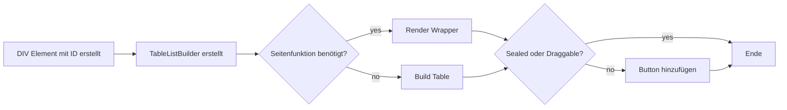

# plan2travel4u

Die vorliegende Readme-Datei bietet einen Überblick über die Website zur Urlaubsplanung. Die Website stellt Benutzern eine Vielzahl von Tools und Funktionen zur Verfügung,
 um ihre Reisen zu organisieren und ein selbst gestaltetes Informations-Hub zu erstellen.

## Problemstellung
Problem: Dinge für den Urlaub zu plannen wird schnell unübersichtlich.  
Lösung: Ein übersichtlicher Planner der alle Dinge die man für den Urlaub braucht auf einer Website speichert.

## Ziel
Die Website bietet vordefinierte Tools, die Benutzern bei der Vorbereitung und Organisation ihrer Reisen helfen. Jede Funktion auf der Website stellt dem Benutzer eine eigene Seite zur Verfügung, 
 auf der er seine Reise nach seinen individuellen Wünschen und Bedürfnissen gestalten kann.

## Konzept der Funktionsseiten

Die Funktionen der Website werden in kurzen Bildern (Slidern oder Karussellen) und begleitenden Beschreibungen erläutert.\
Je nach Funktion werden Dropdowns und andere Elemente verwendet. Die Gestaltung und der Aufbau jeder Unterseite sind abhängig von der jeweiligen Funktion.\
Module (Custom HTML-Element und Builder) werden für den generellen Aufbau der Seite verwendet.

## Verwendung der Tables

Zur Generierung der Tables im Frontend wird auf einen Workflow mit Patterns zurückgegriffen.
Der generelle Workflow sieht wie folgt aus:

Das Klassendiagramm ([tableBuilderCD.puml](tableBuilderCD.puml)) zeigt den detailierten Zusammenhang zwischen den einzelnen Komponenten um einen Table zu generieren.\
Die Grundfunktionen lassen sich unter public/js
- service (Bietet die CRUD-Funktionen für die Tables)
- table (Konkrete Implementierung der Tables)
- wrapper (Die Wrapper um die Tables mit spezifischen Funktionen zu erweitern)
- pattern (Buttonfactory, Tablebuilder, commands (table und wrapper))
- firebase (Authentifizierung und Datenbankzugriff)

finden.

## Technologiestack

### Backend
Node.js mit express.js\
Firebase zur Authentifizierung als Admin

### Frontend
HTML und CSS (Bootstrap)\
Javascript mit CDN (Firebase, Fontawesome)

## Installation

Firebase\
Im Frontend wird eine CDN verwendet, dadurch muss hier nur im Backend die Dependencies geladen werden.\

Fontawesome (Icons)\
Im Projekt wird die Version 6.4.2 verwendet, welche über CDN im Header initialisiert wird.

Node Version\
Die verwendete Version im Projekt ist 5.0.2 und kann via folgenden Kommando installiert werden
>npm install node@20.10.0

### dependencies

    "dependencies": {
        "bootstrap": "^5.3.3",
        "cookie-parser": "^1.4.6",
        "cors": "^2.8.5",
        "express": "^4.19.1",
        "express-status-monitor": "^1.3.4",
        "firebase": "^10.5.2",
        "firebase-admin": "^12.0.0"
    }

express-status-monitor\
Live monitoring der Endpunkte und Ressourcen

firebase\
Für die Authentifizierung auf der Serverseite, um auf den geschützten Statusmonitor zuzugreifen.

## Endpunkte

https://plan2travel4u.azurewebsites.net/
- / <=> /index (Landingpage)
- /suitcase (Funktionsseite zum packen eines Koffers)
- /destination (Planer für die beste Reisezeit)
- /status (Statusmonitoring)

# Allgemein

Hinzufügen aller Abhängigkeiten
> npm install

start den Applikation
> npm start

Serverkonfiguration
>PORT:8080\
>IP: 0.0.0.0

Applikationsdatei
>/app/server.cjs

Es wird eine Node.js-Umgebung benötigt.

## Dev

Endpunkte
>/status\
>Kann lokal ohne Anmeldung aufgerufen werden.

## Deployment

Endpunkte
>/status\
>Benötigt einen User in Firebase der das Flag isAdmin auf true gesetzt hat. 

### Firebase-admin

Damit die serverseitige Authentifizierung durchgeführt werden kann, muss ein private Key generiert werden.\
Siehe: https://firebase.google.com/docs/admin/setup

To generate a private key file for your service account:
>In the Firebase console, open Settings > Service Accounts.\
>Click Generate New Private Key, then confirm by clicking Generate Key.\
>Securely store the JSON file containing the key.

Diese muss unter folgendem Pfad, mit folgendem Namen, hinzugefügt werden
>/app/firebaseSDK.json

### Firebase

Es wird ein Google-Acount für die Speicherung der Daten in der Cloud benötigt.\
Es reicht die gratis Version (stand 06/2024) von Firebase um die Applikation zu betreiben.

In der Firebaseconsole müssen folgende Services aktiviert werden:
- Authentication
- Realtime Database

Unterstützte Anmeldemethoden (Diese müssen unter Authentication aktiviert werden):
-  E-Mail-Adresse/Passwort

In der Realtime Database (unter Regeln) müssen folgende Regeln gesetzt werden, damit die User nur auf deren Daten zugreifen können.

    {
    "rules": {
    ".read": "auth != null",
    ".write": "auth != null",
    "users": {
    "$userId": {
    ".read": "auth.uid == $userId",
    ".write": "auth.uid == $userId"
                }
            }
        }
    }
### Firebaseconfig

Nach einrichten des Account muss in der Firebaseconsole unter:
>Projektübersicht/Projekteinstellungen/Allgemein

im unteren Feld "SDK-Einrichtung und -Konfiguration" unter CDN die

>  const firebaseConfig = {\
apiKey: "",\
authDomain: "",\
databaseURL: "",\
projectId: "",\
storageBucket: "",\
messagingSenderId: "",\
appId: "",\
measurementId: ""\
};

kopieren und hier im Projekt unter

>public\js\firebase\firebaseConfig.js
 
eingefügt werden, damit Firebase konfiguriert ist.

