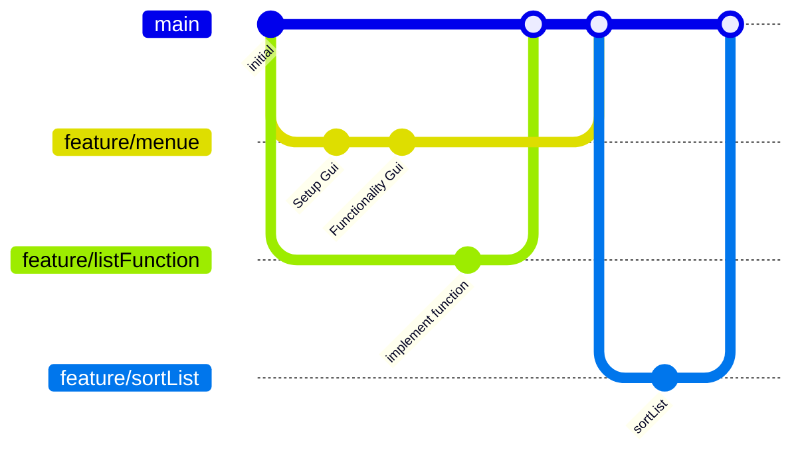

# Development

<ul>
<li>Neue Features werden vom main-branch erstellt.
<li>Ist ein Feature-branch abgeschlossen, kann dieser mit dem main-branch gemerged werden.
<li>Etwaige Meilensteine werden via Tag im Main-branch gekenzeichnet.
<ul>
 
 
> **Note**
> Features sind neu umzusetzende Implementierungen
 

